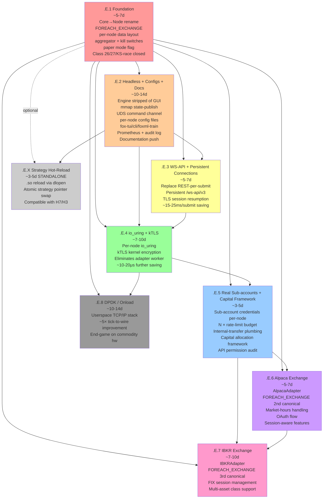

# v5.15.5.F.4d.1.E sub-sprint — ship dependency graph

DAG showing how `.E.1` through `.E.8` + standalone `.E.X` depend on each other. Critical reference for:
- Ordering ships correctly (topological sort)
- Identifying cross-ship invariants (what must hold across boundaries)
- Tracking design decisions that affect downstream ships
- Verifying no circular dependencies
- Identifying parallelization opportunities (independent ships can be drafted in parallel; coding serial)

## DAG visualization (Mermaid)



## Critical path

```
.E.1 → .E.2 → .E.3 → .E.4 → .E.5 → .E.6 → .E.7 → .E.8
~5-7   ~10-14  ~5-7   ~7-10  ~3-5   ~5-7   ~7-10  ~10-14
                                                       
Total: ~52-74 days focused work on critical path
Plus .E.X (strategy hot-reload): ~3-5 days; slots between .E.2 and .E.3 OR anywhere after .E.2
```

## Per-ship dependency table

### `.E.1` Foundation
**Depends on:** `.E.0.1` (pre-`.E.1` foundational-fix net — FP+replay determinism CI gates GREEN) ← `.E.0` (audit gate) ← `.D.1` (shipped). **NEW gate (D-74):** `.E.0.1` must be GREEN before `.E.1` codes — the rename can't silently regress FP/replay determinism if the gates are already standing.
**Impacts (downstream invariants established):**
- Cluster/Node hierarchy data layout (every downstream ship uses this)
- FOREACH_EXCHANGE framework substrate (`.E.6/.E.7` add rows)
- Per-node data layout supports sub-account binding (`.E.5` wires real sub-accounts into the slots)
- Aggregator + hierarchical kill switches (`.E.2-.E.7` extend; `.E.2` publishes for viewers)
- Core → Node hard rename throughout (every downstream code touches Node, not Core)
- Per-node paper mode flag (`.E.6` adds Alpaca paper mode interaction)
- Class 26 + Class 27 + KS race closed structurally
- DESIGN_PHILOSOPHY substantial extensions
- Dev vs production thread topology cfg flag
**NEW DESIGN_SPECS:**
- foreach-exchange-meta-registry-pattern (Stage 3)
- foreach-subaccount-meta-registry-pattern (Stage 3)
- cluster-node-hierarchy-filesystem-layout-pattern (Stage 3)
- per-cluster-shared-resource-pattern (Stage 3)
- global-aggregator-readonly-pattern (Stage 3)
- kill-switch-hierarchical-pattern (Stage 3)
- per-node-paper-mode-flag-pattern (Stage 3)
- runtime-mutable-vs-boot-time-config-pattern (Stage 3)
- exchange-adapter-tt-dispatch-pattern (Stage 3)
- backtest-paper-live-convergence-discipline (Stage 3)
- dev-vs-production-thread-topology-pattern (Stage 3)
- per-cluster-producer-pattern (Stage 3)

### `.E.2` Headless + Configs + Docs
**Depends on:** `.E.1` (cluster/node hierarchy; aggregator publishes state)
**Impacts:**
- Headless engine boundary (every downstream ship works against headless)
- Per-node config file structure (every downstream ship adds new config fields here)
- fox-tui + fox-cli infrastructure (every downstream ship may add new CLI commands)
- Audit log structure (every downstream ship adds new event types)
- Documentation deliverables (every downstream ship adds entries)
- foxml-train CLI (`.E.6/.E.7` test against new exchanges)
- mmap state-publish protocol (every downstream ship publishes new state via this)
- UDS command channel (every downstream ship may add new commands)
**NEW DESIGN_SPECS:**
- headless-engine-viewer-split-pattern (Stage 3)
- hierarchical-config-with-per-node-folders (Stage 3)
- dual-format-metrics-publication-pattern (Stage 3)
- native-tui-via-mmap-readonly-pattern (Stage 3)
- crash-recovery-via-mmap-state-pattern (Stage 3)
- hierarchical-config-validation-pattern (Stage 3)
- built-in-observability-pattern (Stage 3)
- structured-audit-log-pattern (Stage 3)
- gui-deprecation-decision-rationale (Stage 3)

### `.E.3` WS-API + Persistent Connections
**Depends on:** `.E.1` + `.E.2` (cluster topology; headless boundary established)
**Impacts:**
- Persistent connection management (`.E.4` builds io_uring on top)
- TLS session pool (`.E.4` integrates kTLS; `.E.8` integrates DPDK)
- BinanceAdapter worker upgraded (`.E.4` replaces it entirely)
- Submit latency baseline shifts (subsequent ships benchmark against new baseline)
**NEW DESIGN_SPECS:**
- persistent-ws-connection-management-pattern (Stage 3)

### `.E.4` io_uring + kTLS
**Depends on:** `.E.1` + `.E.2` + `.E.3` (persistent connection model + kernel encryption sister)
**Impacts:**
- Adapter worker thread DELETED (eliminates last shared trading-flow thread per cluster)
- Per-node io_uring rings (operationally per-node; per-NUMA aware)
- kTLS configuration (kernel cipher availability; .E.8 may further optimize via DPDK)
- Significant code restructure in adapter path
- Latency baseline shifts substantially (~10-20μs improvement)
**NEW DESIGN_SPECS:**
- io-uring-kernel-bypass-pattern (Stage 3)

### `.E.5` Real Sub-accounts + Capital Framework
**Depends on:** `.E.1` + `.E.4` (per-node data layout supports sub-account; io_uring per-node owns own credentials)
**Impacts:**
- N × rate-limit budget realized (per-cluster aggregation handles this)
- Internal-transfer plumbing (used at `.E.6/.E.7` for cross-cluster capital moves)
- API permission audit (every cluster's credentials validated)
- Capital allocation policy framework (reserve_pct + max_per_node_pct)
**NEW DESIGN_SPECS:**
- per-node-economic-isolation-pattern (Stage 3)
- capital-allocation-policy-pattern (Stage 3)

### `.E.6` Alpaca Exchange
**Depends on:** `.E.1` + `.E.5` (FOREACH_EXCHANGE framework + sub-account substrate; Alpaca = virtual partition since no real sub-accounts)
**Impacts:**
- 2nd canonical of FOREACH_EXCHANGE (Stage 3 → Stage 4 promotion)
- Market-hours handling per-exchange (cross-day position management)
- Per-exchange session-aware feature registry (ML side)
- Per-exchange auth flavor (Alpaca: API key headers vs Binance: HMAC)
**NEW DESIGN_SPECS:**
- per-exchange-session-awareness-pattern (Stage 3)

### `.E.7` IBKR Exchange
**Depends on:** `.E.1` + `.E.5` + `.E.6` (FOREACH_EXCHANGE 3rd canonical; multi-asset class support)
**Impacts:**
- 3rd canonical of FOREACH_EXCHANGE (validates framework at scale)
- FIX session management (NEW protocol family)
- Multi-asset class support (stocks + options + futures + forex)
- Symbol notation handling (TWS-specific)

### `.E.8` DPDK / Onload
**Depends on:** `.E.1` + `.E.4` (per-node I/O architecture; kernel-bypass extension)
**Impacts:**
- Userspace TCP/IP (substantial code restructure in I/O path)
- ~5× tick-to-wire improvement
- End-game on commodity hardware
**NEW DESIGN_SPECS:**
- dpdk-userspace-networking-pattern (Stage 3)

### `.E.X` Strategy Hot-Reload (standalone)
**Depends on:** `.E.1` (per-node strategy dispatch) + `.E.2` (UDS command channel for reload trigger)
**Slots:** anywhere after `.E.2`; recommended between `.E.2` and `.E.3` for early power-user availability OR after all critical ships land
**Impacts:**
- .so build target per strategy (build.sh extends)
- Per-node strategy pointer swap (atomic; H7/H3 compatible)
- dlopen/dlclose lifecycle management
**NEW DESIGN_SPECS:**
- strategy-hot-reload-via-dlopen-pattern (Stage 3)

## Cross-ship invariants (must hold across boundaries)

These invariants are LANDED at one ship and MUST be preserved by all subsequent ships:

| Invariant | Established at | Preserved by |
|---|---|---|
| H1-H20 (existing strict invariants) | pre-`.E.1` | every ship |
| Cluster/Node hierarchy data layout | `.E.1` | every downstream ship |
| Core → Node rename complete | `.E.1` | every downstream ship (no `core_X` references) |
| FOREACH_EXCHANGE registry coverage | `.E.1` | `.E.6` + `.E.7` add rows; framework body unchanged |
| Per-node config file structure | `.E.2` | every downstream ship adds new fields per X-macro |
| mmap state-publication protocol | `.E.2` | every downstream ship publishes new state per protocol |
| UDS command channel | `.E.2` | every downstream ship may add new commands per protocol |
| Headless engine (no GUI dep) | `.E.2` | every downstream ship preserves; no GUI re-introduction |
| Audit log JSONL format | `.E.2` | every downstream ship adds event types per schema |
| Persistent WS-API connection (Binance) | `.E.3` | `.E.4` integrates io_uring at this layer |
| io_uring per-node | `.E.4` | `.E.5/.E.6/.E.7/.E.8` work with this I/O substrate |
| kTLS for kernel-side encryption | `.E.4` | `.E.8` may extend with DPDK userspace TLS |
| Real sub-accounts wired (Binance) | `.E.5` | `.E.6` (Alpaca virtual partition) + `.E.7` (IBKR FA structure) compose |
| FOREACH_EXCHANGE Stage 4 promotion | `.E.6` | confirmed at `.E.7` 3rd canonical |
| Backtest → paper → live discipline | `.E.1` | `.E.6` Alpaca tests; every strategy migration follows |
| Dev vs production thread topology | `.E.1` | every downstream ship preserves dev-mode functional + production-mode strict |

## Parallelization opportunities

Plan body drafting can be parallel (each ship's plan body is independent until cross-references):
- `.E.1` plan body MUST be drafted first (establishes substrate)
- `.E.2` plan body can be drafted in parallel with `.E.3/.E.4/.E.5/.E.6/.E.7/.E.8` plan bodies (different substrates)
- After all drafts: synthesize cross-references; verify dependency graph consistent

Coding MUST be serial along the critical path:
- `.E.1` blocks `.E.2-.E.8`
- `.E.2` blocks `.E.3+`
- `.E.5` blocks `.E.6/.E.7`
- `.E.3+.E.4` block `.E.8`
- `.E.X` slots independently after `.E.2`

## Audit gates per ship

Each ship gets the FULL audit gate per `feedback_audit_canonical_sister_before_new_infra` + `feedback_audit_own_proposals_with_same_rigor`:

**At plan body draft (cycle 1):**
- `/precoding-audit-gate` HIGH-RISK tier (5 agents): parity-check + trace-deps + dod-audit + readiness + blindspot-scan
- `/parity-check` deeper (train-serve cluster-axis is NEW since `.E.1`)
- `/blindspot-scan` 12-pillar taxonomy
- Decision log per-ship sidecar

**At ship close:**
- `/post-ship-audit` retrospective
- `/parity-check` verify train-serve still parity
- `/test-strength-audit` catch test weakening
- `/dod-audit` verify pattern application
- Ledger writes (PARITY / TECH_DEBT / Class catalog)
- Postmortem
- `/sync-workspace` (Check 11 mechanical pre-commit)
- `/handoff` for next session

**Special audits for specific ships:**
- `.E.4` io_uring: `/latency-track` + `/hft-audit` (deep engineering; latency-critical)
- `.E.6/.E.7` exchange additions: `/registry-fit-audit` (verifies FOREACH_EXCHANGE adoption clean)
- `.E.8` DPDK: full latency benchmark suite; verify 5× target hit
- `.E.X` hot-reload: `/parity-check` (atomic swap correctness); chaos test (kill mid-reload)

## Cross-ship impact tracking

When something at ship X affects ship Y > X:

| Impact source | Surface | Affected ships | Mitigation |
|---|---|---|---|
| `.E.1` Core → Node rename | All code | `.E.2+` | Every ship preserves rename; no `core_X` references reintroduced |
| `.E.1` FOREACH_EXCHANGE | Registry | `.E.6/.E.7` | Adding new exchange = 1 row + adapter impl; framework body unchanged |
| `.E.1` Per-node data layout | NodeContext | `.E.5+` | Sub-account fields ALREADY in NodeContext slots; `.E.5` wires credentials |
| `.E.2` Per-node config file structure | Cfg parser | `.E.3+` | Adding new field = 1 row in FOREACH_PER_NODE_CFG_FIELD + per-node file gets row |
| `.E.2` mmap state-publish protocol | State layout | `.E.3+` | Adding new metric = 1 row in state struct; backward-compat via versioning |
| `.E.2` UDS command channel | Protocol | `.E.3+` | Adding new command = 1 verb in fox-cli; protocol versioned |
| `.E.2` Audit log JSONL schema | Event types | `.E.3+` | Adding event type = new JSONL row type; consumers tolerate unknown types |
| `.E.3` Persistent WS-API | Connection mgmt | `.E.4` | io_uring INTEGRATES with persistent connection; doesn't replace |
| `.E.4` io_uring per-node | I/O architecture | `.E.5-.E.8` | All downstream I/O work uses io_uring; no kernel sock path remaining |
| `.E.4` kTLS | TLS handling | `.E.8` | DPDK may further optimize OR use userspace TLS; kTLS path preserved for fallback |
| `.E.5` Real sub-accounts | Credentials | `.E.6+` | Alpaca uses single account; sub-account substrate stays for Binance |

## Risk surfaces per ship

| Ship | Risk class | Primary concern | Mitigation |
|---|---|---|---|
| `.E.1` | HIGH | Massive scope; Core→Node rename touches everything | 5-agent audit gate; mechanical refactor; comprehensive tests; pre-tag rollback |
| `.E.2` | HIGH | First-time headless boundary; mmap protocol design | 5-agent audit gate; testnet smoke tests; comprehensive docs |
| `.E.3` | MED-HIGH | WS-API is NEW protocol; persistent connection edge cases | parity-check; testnet integration test deeper; reconnect chaos test |
| `.E.4` | HIGH | Deepest engineering; io_uring complexity; kTLS cipher constraints | 5-agent audit gate; kernel version requirements documented; fallback paths |
| `.E.5` | MED | Sub-account operational complexity; permission audit critical | Testnet integration tests; permission validation rigorous |
| `.E.6` | MED | First multi-exchange canonical; OAuth flow new | Alpaca paper mode integration test deep |
| `.E.7` | HIGH | FIX protocol complexity; multi-asset class | TWS sandbox integration test; FIX library evaluation |
| `.E.8` | HIGH | DPDK substantial restructure; userspace TCP/IP | Latency benchmark before/after rigorous; fallback to kernel I/O path |
| `.E.X` | MED | dlopen lifecycle; atomic strategy swap correctness | parity-check; chaos test mid-reload |

## Ledger writes per ship (auto-write contracts)

Each ship at close writes:

| Ledger | Per-ship typical entries |
|---|---|
| PARITY_ISSUES.md | 0-2 entries per ship (train-serve drift surfaces) |
| TECH_DEBT.md | 0-3 entries per ship (deferred items) |
| Class catalog | 0-2 amendments per ship (NEW Worked Examples; recurrence_count bumps) |
| FEATURE_LOOKUP.md | 1-3 entries per ship (operator-facing features) |
| DESIGN_SPECS Stage promotions | 2-5 promotions per ship |
| memory/ | 0-2 NEW memory files per ship (new feedback rules) |

## End-of-`.E` deliverables

After all 8 ships (+ optional `.E.X`) land:

- Multi-exchange substrate (Binance + Alpaca + IBKR ready; framework supports more)
- Per-node sub-account isolation (real sub-accounts on Binance; virtual on Alpaca/IBKR)
- Headless engine + viewer split (fox-engine + fox-tui + fox-cli + foxml-train)
- io_uring + kTLS kernel-bypass I/O (per-node)
- WS-API persistent connections (per-cluster)
- DPDK userspace networking (~3-5μs tick-to-wire)
- Per-node hot/slow decoupling preserved
- Hierarchical kill switches (global / cluster / node)
- Capital allocation policy framework
- Class 26 + Class 27 + KS race closed structurally
- ~25 NEW DESIGN_SPECS (many Stage 4 cohort)
- DESIGN_PHILOSOPHY substantially extended
- Comprehensive documentation (DEPLOYMENT_GUIDE + OPERATOR_MANUAL + ARCHITECTURE_OVERVIEW + GLOSSARY + INCIDENT_RUNBOOK + STRATEGY_LIFECYCLE + DR_TESTING + CONTRIBUTING/)
- Software version v0.1.0

End of dependency graph.
